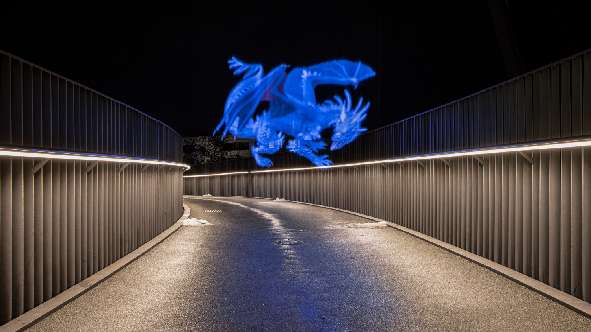
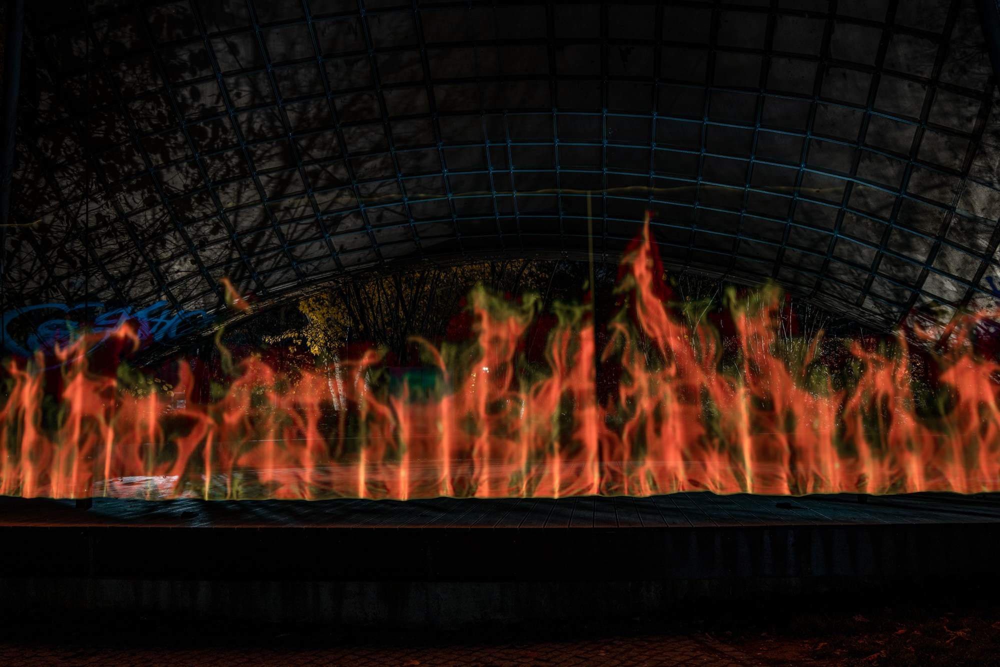
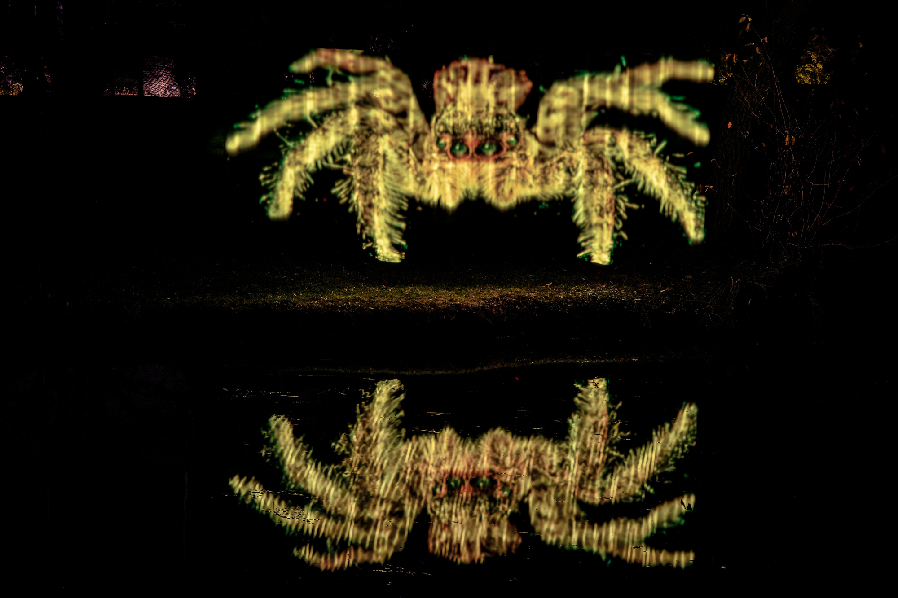
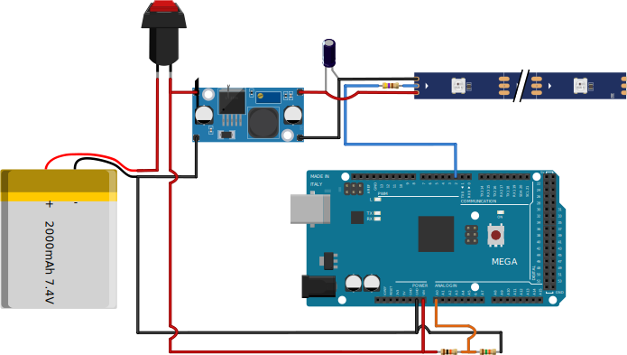
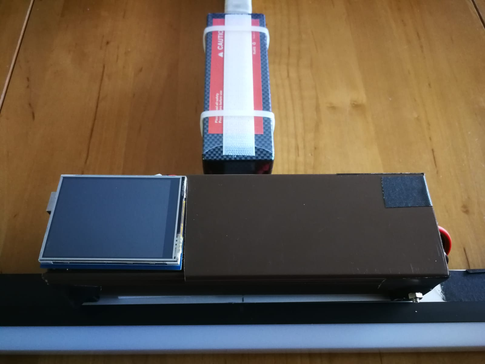
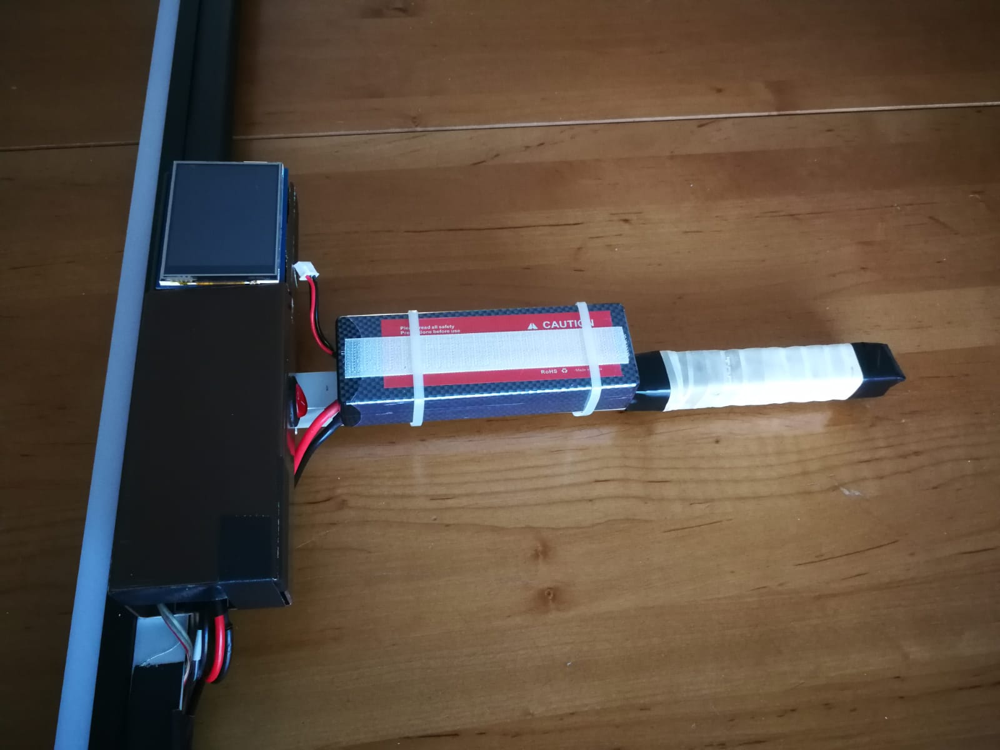
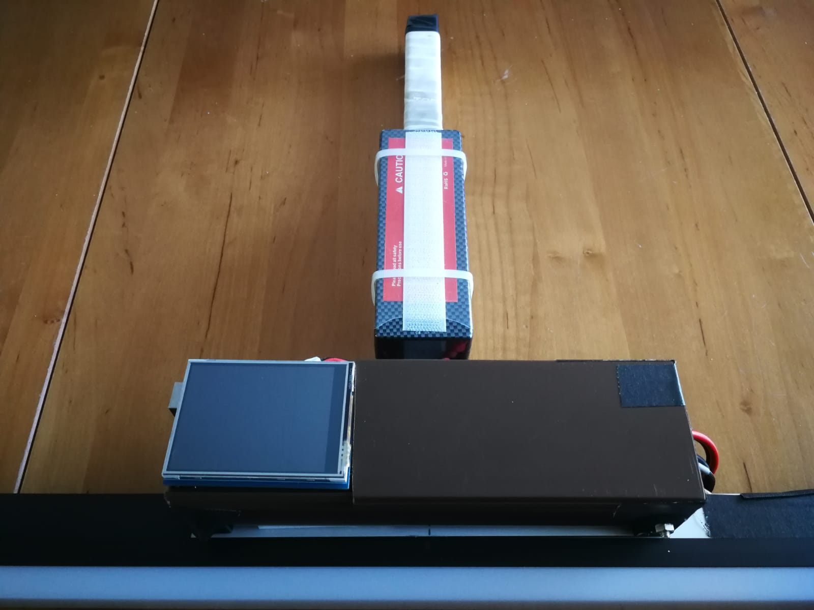
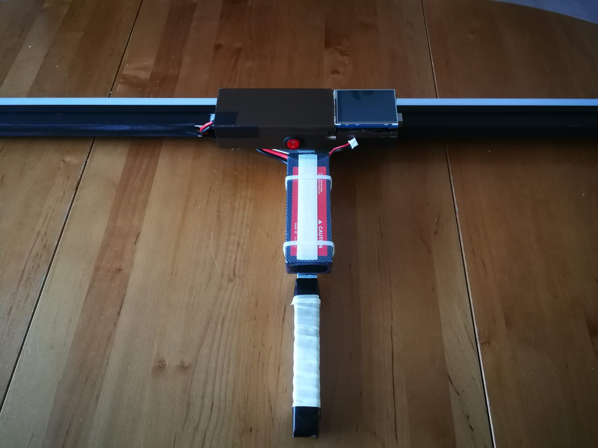
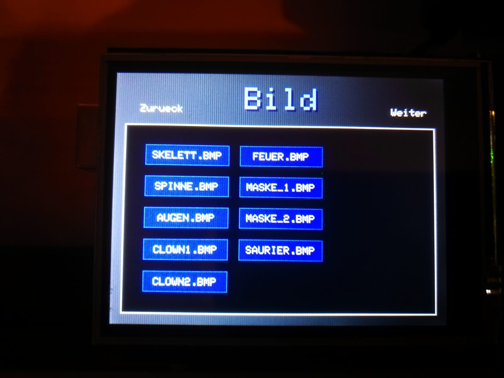
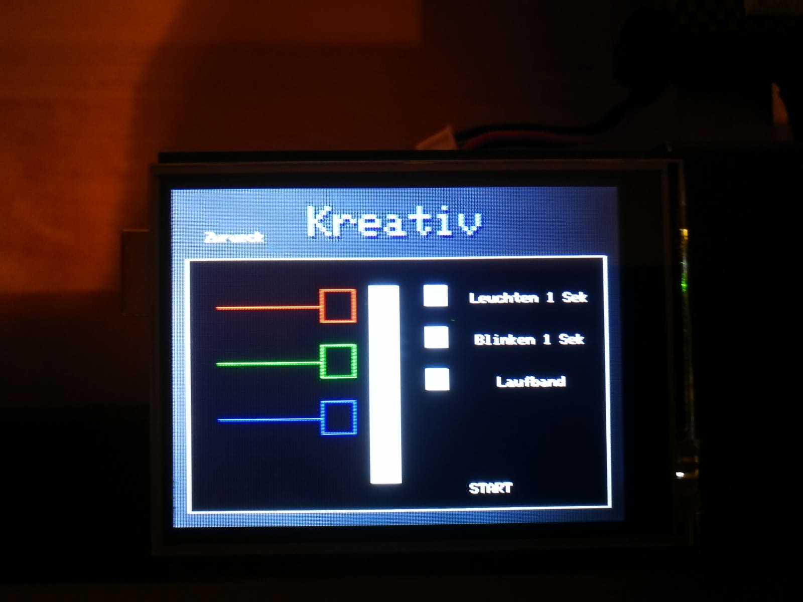

# PhotoStick
This is a fork of https://github.com/manuelmohr/PhotoStick. The goal of this fork is to:
- Done: Change the development environment to Platform IO 
- Done: Make it work with generic 3.5" TFT screen
- Done: Changed to use Software SPI to connect to microSD. Speed is sufficient for this application
- Done: Adapted GUI to a larger 3.5" TFT
- Make it work with images < 288 pixels widht
- Possibly add a status bar to indicate errors with files or that display is running
- Make Backlight dimming work with 3,5" TFT

# What is this?
- The photo stick is a DIY project to build an LED-based light-painting device
- Using long exposure times, the photo stick allows you to project arbitrary images into the air
- The images are BMP files loaded from a microSD card
- The photo stick provides comfortable touchscreen-based navigation and configuration
- The project requires very basic soldering skills
- The total material cost is around 150€ (but you might already have some required parts)
- The photo stick is a DIY clone of [the Pixelstick](http://www.thepixelstick.com/)

# Example shots

# Using this software
- Install the [Arduino IDE](https://www.arduino.cc/en/software)
- Clone the repository
- Install the following libraries via Arduino's library manager:
  - `FastLED`
  - `SdFat`
  - `Adafruit_GFX_Library`, `Adafruit_ILI9341`, `Adafruit_STMPE610`, `Adafruit_TouchScreen`
  - `GUISlice`
- *IMPORTANT*: Modify GUISlice's configuration in the following way:
  - Open `Arduino/libraries/GUIslice/src/GUIslice_config.h`
  - Remove the comment in front of the line `#include "../configs/ard-shld-adafruit_28_res.h"`
- Open `Photostick.ino` in the Arduino IDE
- Compile, load, and use
- Optional: Adapt settings `config.hpp`, especially if you used non-standard pins

# Material
- 1x Arduino Mega or compatible ([Example](https://www.amazon.de/Mikrocontroller-ATmega2560-ATMEGA16U2-USB-Kabel-Kompatibel/dp/B01MA5BLQI/))
- 1x 2.8" TFT Touch Shield for Arduino ([Example](https://www.exp-tech.de/displays/tft/4764/adafruit-2.8-tft-touch-shield-fuer-arduino-v2))
- 2x WS2812B LED strip with high LED density, ideally 144 LED/m ([Example](https://www.amazon.de/BTF-LIGHTING-WS2812B-adressierbare-Streifen-NichtWasserdicht/dp/B01CDTEJR0/))
- 1x DC/DC Converter, at least 100W rating (to be on the safe side) ([Example](https://www.amazon.de/Akozon-Wandlermodul-Abwärtswandler-Step-down-Modul-Konstantstrom-LED-Treiber/dp/B07GXQ8MNG/))
- 1x LiPo 2S battery, 7.4V ([Example](https://www.amazon.de/FLOUREON-5200mAh-Deans-T-Stecker-Evader/dp/B00KGS4NZE/))
- 1x LiPo compatible charger
- 1x XT60 connector (male)
- 1x cable conduit 40mm x 60mm, length: 30--40cm
- 2x aluminum profile rail, length 2 meters, with plastic cover, not fully transparent
- 1x switch ([Example](https://www.amazon.de/CARCHET-Wippschalter-Selbsthemmung-Silberfarbe-Korrosionsbestänig/dp/B00OQ01XR4/))
- 1x microSD card
- Cables
- Soldering iron
- Multimeter

# Connection Diagram

# Assembly Instructions
- Solder jumper 3 on touch display
    - This enables backlight toggling from software
    - https://learn.adafruit.com/adafruit-2-8-tft-touch-shield-v2/backlight-touch-irq#
- Solder the two LED strips into one
- Solder LED data wire to data pin 2 of Arduino
- Connect LED shield to Arduino
- Flash software

# Usage
- Create image with height of 288 pixels (and arbitrary width)
- *Rotate clockwise by 90 degrees* (image now has *width* of 288 pixels)
- Save as BMP with either 24-bit or 32-bit depth

# Finished assembly
Compact assembly with external battery:

User interface:

